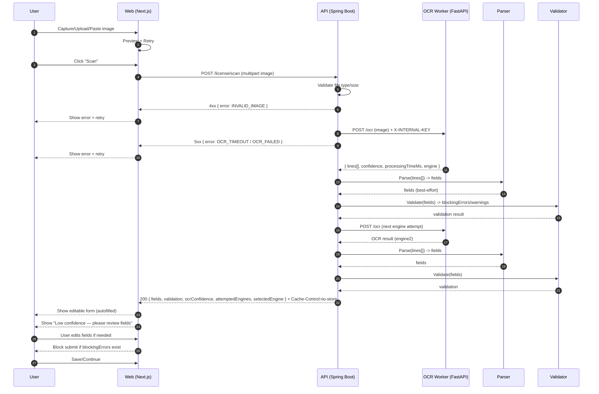
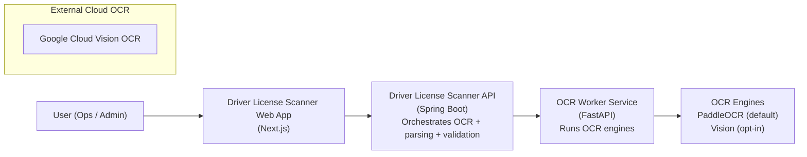
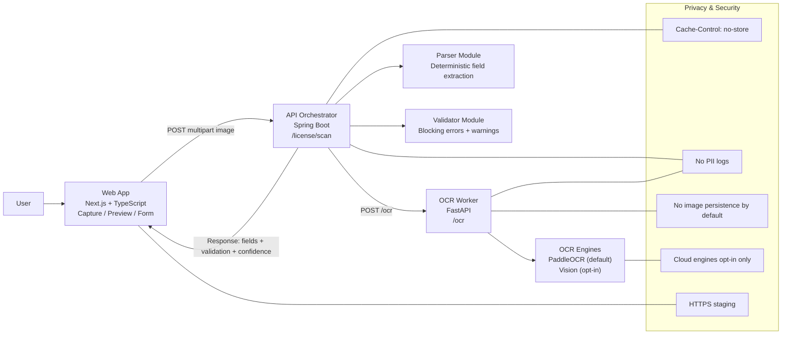
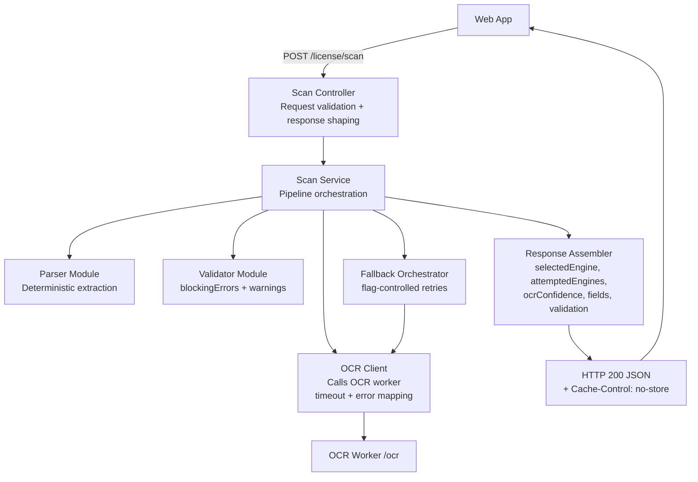
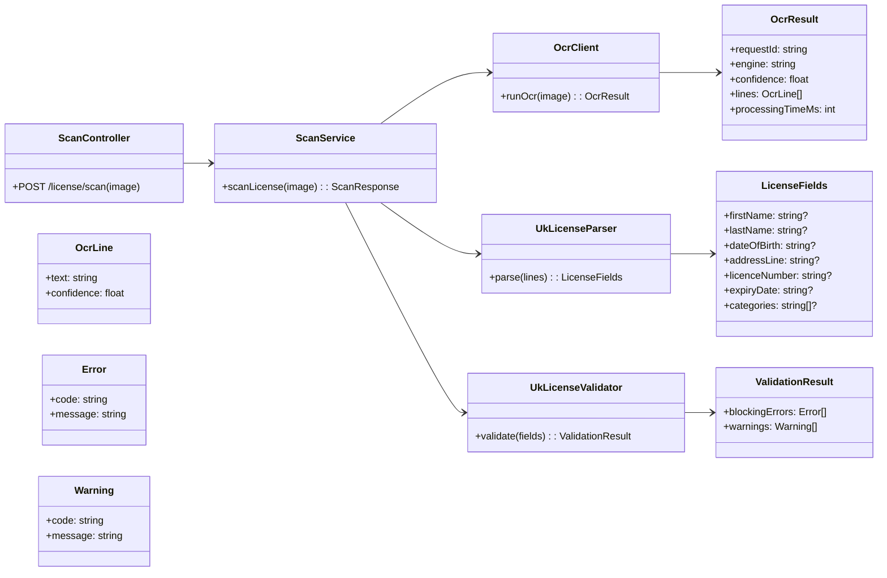

# Gate 2 — Architecture & Design

## System context (high level)

**User** interacts with the **Web UI** to capture/upload a UK driving licence image.  
The **API** orchestrates OCR + parsing + validation and returns structured fields.  
The **OCR Worker** performs OCR and returns raw text + confidence.

---

### System Flow Diagram

```mermaid
flowchart LR
    Start(["User Action"]) --> Input{"Input Method"}
    Input -- Camera --> Camera["Web: Camera Capture<br>getUserMedia / react-webcam"]
    Input -- Upload --> Upload["Web: File Upload<br>Drag &amp; Drop"]
    Input -- Paste --> Paste["Web: Paste Image<br>Ctrl+V"]
    Camera --> Img["Image File (in memory)"]
    Upload --> Img
    Paste --> Img
    Img --> Preview["Web: Preview Screen<br>Retry / Retake / Continue"]
    Preview -- Retry --> Input
    Preview -- Scan --> WebCall["Web -&gt; API<br>POST /license/scan<br>multipart=image"]
    WebCall --> ScanSvc["API: Scan Service"]
    Fallback["API: Fallback Orchestration<br>bounded attempts"] --> OCRWorkerCall["API -&gt; OCR Worker<br>POST /ocr"]
    OCRWorkerCall --> Worker["OCR Worker (FastAPI)"]
    Worker --> EngineSelect{"OCR_ENGINE config"}
    EngineSelect -- paddle --> Paddle["PaddleOCR"]
    EngineSelect -- vision --> Vision["Google Vision<br>(opt-in flag + creds)"]
    Paddle --> OCRResult["OCR Result<br>lines[] + confidence + timing"]
    Vision --> OCRResult
    OCRResult --> OCRDecision{"Confidence / Parse Quality OK?"}
    OCRDecision -- Yes --> Parse["API: Parser Module"]
    OCRDecision -- No + fallback on --> Fallback
    OCRDecision -- No + fallback off --> Parse
    Parse --> Fields["Parsed Fields<br>name, DOB, address (incl. postcode),<br>licenceNo, expiry"]
    Fields --> Validate["API: Validator Module"]
    Validate --> ValOut["Validation Result<br>blockingErrors[] + warnings[]"]
    ValOut --> Response["API Response Contract<br>fields + validation + metadata<br>Cache-Control: no-store"]
    Response --> WebResult["Web: Result State"]
    WebResult --> LowConf{"ocrConfidence &lt; threshold?"}
    LowConf -- Yes --> Banner["Web: Warning Banner<br>Low confidence — please review fields"]
    LowConf -- No --> NoBanner["No warning"]
    Banner --> Form["Web: Editable Driver Form<br>Auto-filled fields"]
    NoBanner --> Form
    Form --> Errors{"Blocking errors?"}
    Errors -- Yes --> BlockSubmit["Web: Disable Submit<br>Show field errors"]
    Errors -- No --> AllowSubmit["Web: Submit Enabled"]
    BlockSubmit --> Edit["User edits fields"]
    AllowSubmit --> Edit
    Edit --> Save["Save / Continue Flow"]
    Save --> End(["Complete"])
    ScanSvc --> OCRWorkerCall

    Input:::webNode
    Input:::decisionNode
    Img:::outputNode
    Preview:::webNode
    WebCall:::webNode
    ScanSvc:::apiNode
    Fallback:::apiNode
    Worker:::workerNode
    EngineSelect:::workerNode
    Paddle:::workerNode
    Vision:::workerNode
    OCRResult:::outputNode
    OCRDecision:::decisionNode
    Parse:::apiNode
    Fields:::outputNode
    Validate:::apiNode
    ValOut:::outputNode
    Response:::apiNode
    WebResult:::webNode
    LowConf:::decisionNode
    Banner:::webNode
    NoBanner:::webNode
    Form:::webNode
    Errors:::decisionNode
    BlockSubmit:::webNode
    AllowSubmit:::webNode
    Edit:::webNode
    Save:::webNode
    classDef webNode fill:#E3F2FD,stroke:#1976D2,stroke-width:2px
    classDef apiNode fill:#FFF3E0,stroke:#F57C00,stroke-width:2px
    classDef workerNode fill:#E8F5E9,stroke:#388E3C,stroke-width:2px
    classDef decisionNode fill:#FFF9C4,stroke:#F57F17,stroke-width:2px
    classDef outputNode fill:#F3E5F5,stroke:#7B1FA2,stroke-width:2px
```

---

### Sequence Diagram

---

### C4 Level 1 — System Context Diagram

---

### C4 Level 2 — Container Diagram + Guardrails

---

### C4 Level 3 — Component Diagram (API Orchestrator)

---

### C4 Level 4 — Code Diagram (Key Classes / Interfaces)

---

## Data flow and processing steps

1. **Capture/Upload (Web)**
   - User selects or captures image
   - Web validates size + format
   - Web shows preview and allows retry

2. **Scan request (Web → API)**
   - `POST /license/scan` with multipart file `image`
   - Web shows loading state

3. **OCR orchestration (API → OCR Worker)**
   - API forwards image to OCR Worker `POST /ocr`
   - OCR Worker returns `OcrResult`

4. **Parsing (API)**
   - Deterministic parser extracts:
     - firstName, lastName, dateOfBirth
     - addressLine (includes postcode)
     - licenceNumber, expiryDate
     - optional categories
   - Unknowns return null/empty (no guessing)

5. **Validation (API)**
   - Required fields present
  - Postcode format valid in address line
   - Licence number format valid
   - Expiry date not in the past (block)
   - Age outside 21–75 (warning)

6. **Response (API → Web)**
   - Structured fields + warnings/errors
   - Cache headers prevent storing responses

---

## Deployment architecture (staging)

Target staging setup:
- Web: Vercel
- API: Render (Docker)
- OCR Worker: Render (Docker)

Network rules:
- OCR Worker should be private if possible
- If public, protect with internal auth header (`X-INTERNAL-KEY`)
- HTTPS required on all endpoints

---

## Feature flags (safe defaults)

| Flag | Default | Description |
|------|---------|-------------|
| `OCR_ENGINE` | `paddle` | Choose OCR engine |
| `ENABLE_FALLBACK_OCR` | `false` | Enable engine fallback |
| `OCR_CONFIDENCE_WARN_THRESHOLD` | `0.70` | Warn below this |
| `ENABLE_LLM_CLEANUP` | `false` | Optional LLM parsing/cleanup |

---

## Observability (POC level)

API emits metrics (no PII):
- `scan_processing_ms`
- `ocr_processing_ms`
- `selected_engine`
- `ocr_confidence`
- `success/failure` counters
- error code breakdown

Logging rules:
- Log requestId + timing + error codes only
- Never log OCR text or extracted values
- Never log raw image bytes
