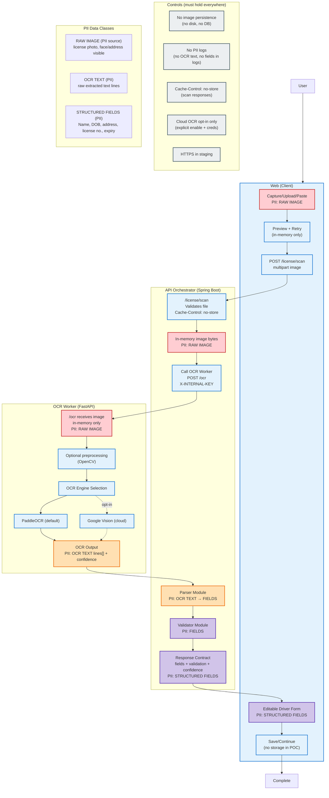

# Gate 2 — Data Flow & PII Boundaries

**Goal:** explicitly document where sensitive data flows and how we prevent leakage.

---

## Data classification

**PII / Sensitive**
- Raw driver licence image
- Extracted OCR text
- Parsed driver fields (name, DOB, address, licence number)

**Non-sensitive metadata**
- requestId
- timing metrics (ms)
- engine name
- confidence score
- error codes

---

## Data flow diagram highlighting PII

*Note:* PII exists in memory within Web/API/OCR Worker during processing.  
The **logs/metrics sink must be non-sensitive** and contain **no OCR text and no field values**.

---

## Privacy guardrails (enforced)
- **No image persistence** by default in API or OCR worker
- **No PII logs** (no OCR text, no parsed fields, no images)
- API responses include: `Cache-Control: no-store`
- HTTPS in staging
- OCR worker protected with `X-INTERNAL-KEY` (recommended)

---

## Safe logging examples

✅ Allowed log line:
- `requestId=... selectedEngine=paddle confidence=0.82 processingMs=920 outcome=SUCCESS`

❌ Forbidden log lines:
- Any line containing:
  - raw OCR text
  - name/DOB/address/licence number
  - image metadata that can identify a person

---

## Security notes (POC level)
- The OCR worker should not be publicly reachable if deployment allows private services.
- If public exposure is required for staging, add:
  - internal auth header
  - basic rate limiting at API level
  - request size limits
